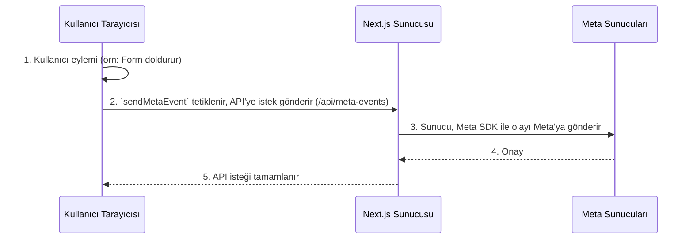

# Meta Conversions API (CAPI) Entegrasyon Rehberi

Bu doküman, bir Next.js projesine sunucu taraflı Meta Conversions API (CAPI) entegrasyonunun nasıl yapılacağını adım adım açıklamaktadır. Amaç, reklam engelleyicilerden ve tarayıcı kısıtlamalarından etkilenmeyen, güvenilir ve yüksek kaliteli dönüşüm takibi sağlamaktır.

## Entegrasyonun Mimarisi

Bu entegrasyon, istemci (tarayıcı) ve sunucu arasında bir köprü kurarak çalışır. Veri akışı aşağıdaki gibidir:



---

## Kurulum Adımları

### Adım 1: Gerekli Paketlerin Kurulumu

Sunucunun Meta ile konuşabilmesi ve olaylar için benzersiz ID'ler üretebilmesi için gerekli kütüphaneleri kurun.

```bash
pnpm install facebook-nodejs-business-sdk uuid
pnpm install -D @types/uuid
```

### Adım 2: Ortam Değişkenleri (`.env.local`)

Hassas bilgileri güvenli bir şekilde saklamak için projenizin kök dizininde `.env.local` dosyası oluşturun ve aşağıdaki değişkenleri ekleyin.

```bash
# Meta Olay Yöneticisi'nden alınacak Pixel ID'niz
META_PIXEL_ID=PIXEL_ID_BURAYA

# Olay Yöneticisi -> Ayarlar -> Conversions API -> Erişim Jetonu Oluştur'dan alınacak.
META_ACCESS_TOKEN=ERISIM_JETONU_BURAYA
```

### Adım 3: Oluşturulan Dosyalar ve Kodları

Bu entegrasyon için 3 ana dosya oluşturulmuştur:

#### 1. TypeScript Tanım Dosyası (Tip Güvenliği için)
*   **Dosya:** `types/facebook-sdk.d.ts`
*   **Amaç:** `facebook-nodejs-business-sdk` JavaScript ile yazıldığı için, TypeScript projemizin bu kütüphaneyi tanımasını sağlayan bir "tanıtım kartı" görevi görür. Bu dosya olmadan proje derlenmez.

```typescript
// types/facebook-sdk.d.ts
declare module 'facebook-nodejs-business-sdk' {
  export const facebook_business: any;
  export const FacebookAdsApi: any;
  export const UserData: new (...args: any[]) => any;
  export const ServerEvent: new (...args: any[]) => any;
  export const EventRequest: new (...args: any[]) => any;
  export const Content: new (...args: any[]) => any;
  export const CustomData: new (...args: any[]) => any;
}
```

#### 2. Sunucu Tarafı API Uç Noktası (Beyin)
*   **Dosya:** `app/api/meta-events/route.ts`
*   **Amaç:** İstemciden gelen olay verilerini kabul eder, Meta'nın istediği formata getirir ve `facebook-nodejs-business-sdk` kullanarak Meta'nın sunucularına güvenli bir şekilde gönderir.

```typescript
// app/api/meta-events/route.ts
import { NextRequest, NextResponse } from "next/server";
import {
  FacebookAdsApi,
  ServerEvent,
  UserData,
  EventRequest,
  CustomData,
} from "facebook-nodejs-business-sdk";

export async function POST(req: NextRequest) {
  try {
    const body = await req.json();
    const { eventName, eventId, userData, customData, eventUrl, fbp, fbc } = body;

    if (!eventName || !userData) {
      return NextResponse.json({ error: "Missing required event data" }, { status: 400 });
    }

    const accessToken = process.env.META_ACCESS_TOKEN;
    const pixelId = process.env.META_PIXEL_ID;

    if (!accessToken || !pixelId) {
      console.error("Meta Pixel ID or Access Token is not defined in environment variables.");
      return NextResponse.json({ error: "Server configuration error" }, { status: 500 });
    }

    FacebookAdsApi.init(accessToken);

    const formattedUserData = new UserData()
      .setEmails(userData.email ? [userData.email] : undefined)
      .setPhones(userData.phone ? [userData.phone] : undefined)
      .setFirstNames(userData.firstName ? [userData.firstName] : undefined)
      .setLastNames(userData.lastName ? [userData.lastName] : undefined)
      .setFbp(fbp)
      .setFbc(fbc)
      .setClientIpAddress(req.headers.get("x-forwarded-for"))
      .setClientUserAgent(req.headers.get("user-agent"));

    const { content_name, ...otherCustomProps } = customData;
    const formattedCustomData = new CustomData()
      .setContentName(content_name)
      .setCustomProperties(otherCustomProps);

    const serverEvent = new ServerEvent()
      .setEventName(eventName)
      .setEventId(eventId)
      .setEventTime(Math.floor(Date.now() / 1000))
      .setUserData(formattedUserData)
      .setCustomData(formattedCustomData)
      .setEventSourceUrl(eventUrl || req.url)
      .setActionSource("website");

    const eventRequest = new EventRequest(accessToken, pixelId);
    eventRequest.setEvents([serverEvent]);

    await eventRequest.execute();

    return NextResponse.json({ status: "success" }, { status: 200 });
  } catch (error) {
    console.error("Meta CAPI Error:", error);
    const errorMessage = error instanceof Error ? error.message : "An unknown error occurred";
    return NextResponse.json(
      { error: "Failed to send event to Meta", details: errorMessage },
      { status: 500 }
    );
  }
}
```

#### 3. İstemci Tarafı Yardımcı Fonksiyonu (Araç)
*   **Dosya:** `lib/meta.ts`
*   **Amaç:** React bileşenlerinin (formlar, butonlar vb.) sunucu API'sini kolayca çağırmasını sağlayan, tekrar kullanılabilir bir fonksiyondur. Olay ID'si üretir, kalite puanını artıran `_fbp` ve `_fbc` çerezlerini okur ve tüm bilgileri sunucuya gönderir.

```typescript
// lib/meta.ts
import { v4 as uuidv4 } from 'uuid';

// Arayüzler ve tipler...
interface UserData {
  email?: string;
  phone?: string;
  firstName?: string;
  lastName?: string;
}
interface CustomData {
  value?: number;
  currency?: string;
  content_name?: string;
  content_ids?: string[];
  [key: string]: string | number | boolean | string[] | undefined;
}
interface SendMetaEventParams {
  eventName: string;
  userData: UserData;
  customData?: CustomData;
  eventUrl?: string;
}
interface SendMetaEventResponse {
  success: boolean;
  eventId?: string;
  error?: string;
}

const getCookie = (name: string): string | null => {
  if (typeof document === 'undefined') return null;
  const value = `; ${document.cookie}`;
  const parts = value.split(`; ${name}=`);
  if (parts.length === 2) return parts.pop()?.split(';').shift() || null;
  return null;
};

export const sendMetaEvent = async ({
  eventName,
  userData,
  customData = {},
  eventUrl = window.location.href,
}: SendMetaEventParams): Promise<SendMetaEventResponse> => {
  try {
    const eventId = uuidv4();
    const fbp = getCookie('_fbp');
    const fbc = getCookie('_fbc');

    const response = await fetch('/api/meta-events', {
      method: 'POST',
      headers: { 'Content-Type': 'application/json' },
      body: JSON.stringify({
        eventName,
        eventId,
        userData,
        customData,
        eventUrl,
        fbp,
        fbc,
      }),
    });

    if (!response.ok) {
      const errorData = await response.json();
      throw new Error(errorData.details || 'Failed to send event to server');
    }

    return { success: true, eventId };
  } catch (error) {
    console.error('Error sending Meta CAPI event:', error);
    const errorMessage = error instanceof Error ? error.message : 'Unknown error';
    return { success: false, error: errorMessage };
  }
};
```

### Adım 4: Bir Bileşen İçinde Kullanım Örneği

Oluşturduğumuz bu altyapıyı, bir form gönderimi gibi önemli bir eylem anında çağırırız.

```typescript
// Örnek: app/[locale]/(routes)/_components/Register/form.tsx

// ... diğer import'lar
import { useCookieConsent } from "../libs/CookieConsent/CookieConsentContext";
import { sendMetaEvent } from "@/lib/meta";

// ...

const InfoForm = () => {
  // ... form hook'ları ve diğer state'ler
  const { consent } = useCookieConsent(); // GDPR için rıza durumunu al

  const sendEmail = async (data: z.infer<typeof formSchema>) => {
    // ... email gönderme mantığı ...

    // Kullanıcı pazarlama izni verdiyse CAPI olayını gönder
    if (consent.marketing) {
      try {
        const { success, eventId } = await sendMetaEvent({
          eventName: "Lead", // Gönderilecek olayın adı
          userData: {
            email: data.email,
            phone: data.phone,
            firstName: data.firstName,
            lastName: data.lastName,
          },
          customData: {
            content_name: 'Bilgi Alma Formu',
          }
        });

        if (success) {
          console.log("Meta CAPI 'Lead' olayı başarıyla gönderildi. Event ID:", eventId);
        }
      } catch (capiError) {
        console.error("Meta CAPI gönderiminde kritik hata:", capiError);
      }
    }
  };

  // ... JSX (return) kısmı
}
```

Bu yapı, projenize sağlam ve yüksek kaliteli bir Meta CAPI entegrasyonu sağlar. Yeni bir olay (örn: `Purchase`) eklemek istediğinizde, tek yapmanız gereken `sendMetaEvent` fonksiyonunu doğru yerde ve doğru parametrelerle çağırmaktır. 